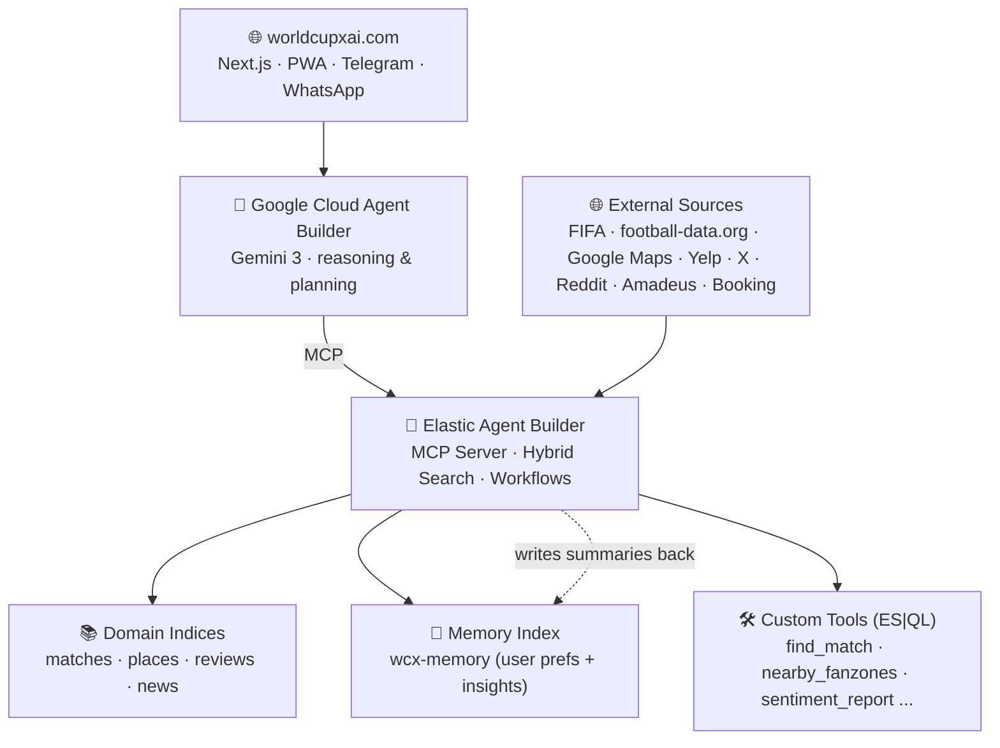
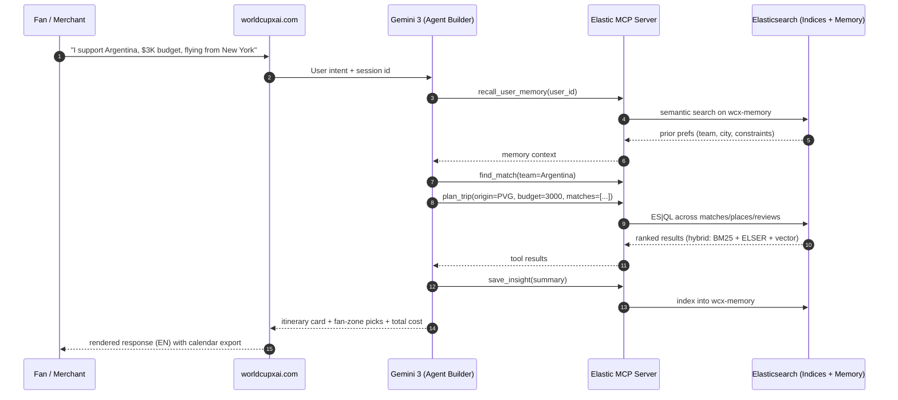

<div align="center">

# ⚽ World Cup X AI

### Your AI Concierge for the 2026 FIFA World Cup
**Plan. Predict. Play — in one conversation.**

[](https://rapid-agent.devpost.com/)
[](https://rapid-agent.devpost.com/details/elastic-resources)
[](https://deepmind.google/technologies/gemini/)
[](https://cloud.google.com/products/agent-builder)
[](./LICENSE)
[](https://worldcupxai.com)

</div>

---

## 🌍 The 50-Billion-Fan Problem

The 2026 FIFA World Cup will span **3 countries**, **16 cities**, **104 matches**, and reach an audience of more than **5 billion people**. For fans, local merchants, fantasy players, and journalists, the experience is broken across dozens of fragmented sources — schedules, tickets, visas, transit, hotels, fan zones, line-ups, injuries, reviews, social chatter, in **multiple languages**.

**World Cup X AI** unifies all of it into a single agent that **reasons, plans, and acts** on your behalf.

> *Built for the [Google Cloud Rapid Agent Hackathon](https://rapid-agent.devpost.com/) — Elastic Partner Track.*

---

## ✨ What it Does

| Module | What the agent does for you |
|---|---|
| ⚽ **Match IQ** | Real-time schedules, line-ups, injuries, broadcast channels & multilingual recaps |
| 🧳 **Fan Logistics** | Cross-city trip planning (flights + ground), hotels, fan zones, visa/ESTA reminders, conflict detection |
| 🍽 **Local Pulse** | Fan-side: nearby bars, restaurants, multilingual menus • Merchant-side: tourist sentiment reports & ready-to-publish campaigns |
| 🎮 **Fantasy Coach** | Live line-up optimization driven by injuries, fixtures, and form |
| 📰 **Media Brief** | One-click 3-minute match recaps and daily global sentiment briefs |

All five modules share a **persistent memory layer** in Elasticsearch, so the agent **remembers who you support, your budget, your trips, and your prior decisions** — turning raw signals into retrievable intelligence over time.

---

## 🏗 High-Level Architecture



---

## 🔁 Agent Decision Loop



---

## 🧱 Elastic Integration (Depth that wins the track)

### Indices
| Index | Purpose |
|---|---|
| `wcx-matches` | Fixtures, line-ups, injuries (structured + vectorized summaries) |
| `wcx-places` | Cities, restaurants, hotels, fan zones (geo + review embeddings) |
| `wcx-reviews` | Multilingual reviews with ELSER semantic enrichment |
| `wcx-news` | News + public social posts, near-real-time |
| `wcx-memory` | **Agent memory** — user preferences, decisions, generated insights |
| `wcx-fantasy` | Fantasy line-ups and historical optimization decisions |

### Custom MCP Tools
| Tool | Backed by | What it returns |
|---|---|---|
| `find_match` | ES\|QL on `wcx-matches` | Fixtures by team / city / date |
| `nearby_fanzones` | ES\|QL + `geo_distance` on `wcx-places` | Top-N venues around a point |
| `semantic_review_search` | ELSER hybrid search on `wcx-reviews` | Cross-language review snippets |
| `sentiment_report` | ES\|QL `STATS BY sentiment` | Merchant-facing aggregates |
| `recall_user_memory` | `semantic_text` on `wcx-memory` | Prior user context |
| `save_insight` | Bulk index API on `wcx-memory` | Confirmation + doc id |
| `fantasy_optimize` | ES\|QL + LLM rerank on `wcx-fantasy` | Suggested line-up changes |

### Workflows (multi-step + sub-agents)
- **`plan_trip`** — parallel sub-agents for flights, hotels, fixtures → conflict detection → itinerary synthesis → memory write-back
- **`matchday_brief`** — T-5min trigger → pull line-up + injury + sentiment → generate brief → push to user channel
- **`merchant_brief`** — pull last-7-days reviews → multilingual cluster → sentiment → draft bilingual campaign copy

---

## 🛠 Tech Stack

| Layer | Technology |
|---|---|
| Domain | [worldcupxai.com](https://worldcupxai.com) |
| Frontend | Next.js 15 · Tailwind · Vercel · PWA |
| Channels | Web Chat · Telegram Bot · WhatsApp Business |
| Agent Orchestration | **Google Cloud Agent Builder** + **Gemini 3** |
| Tools & Retrieval | **Elastic Cloud Serverless** + **Elastic Agent Builder (MCP)** |
| Data Ingest | Elastic native connectors · Cloud Run cron jobs |
| Auth | Google OAuth (user) · Elasticsearch API Key (backend) |
| Observability | Google Cloud Logging · Elastic telemetry |

---

## 🚀 Quickstart

> Targeting Node 20+, pnpm, and a Google Cloud project with Vertex AI + Agent Builder enabled.

```bash
# 1. Clone
git clone https://github.com/AIoOS-67/worldcupxai.git
cd worldcupxai

# 2. Install
pnpm install

# 3. Configure environment
cp .env.example .env.local
#   ELASTIC_CLOUD_URL=...
#   ELASTIC_API_KEY=...
#   GCP_PROJECT_ID=...
#   GEMINI_MODEL=gemini-3-pro
#   MCP_ENDPOINT=https://<your-elastic>/api/agent_builder/mcp

# 4. Bootstrap Elastic indices and seed data
pnpm run elastic:bootstrap

# 5. Register MCP tools with Agent Builder
pnpm run agent:register

# 6. Run the web app
pnpm dev
# → http://localhost:3000
```

### Hooking Google Cloud Agent Builder to Elastic
1. In Elastic Cloud, create a **Serverless Elasticsearch** project (any Google Cloud region).
2. Enable **Agent Builder** from Kibana → copy the MCP endpoint.
3. In Google Cloud Agent Builder, add an **MCP tool source** pointing to that endpoint and authenticate with the Elasticsearch API key.
4. Gemini 3 will now discover every tool defined in this repo.

Full walkthrough: [`docs/setup.md`](./docs/setup.md)

---

## 📂 Repository Layout

```
worldcupxai/
├── apps/
│   ├── web/                # Next.js frontend (worldcupxai.com)
│   └── agent/              # Agent Builder configs & tool registrations
├── infra/
│   ├── elastic/
│   │   ├── mappings/       # Index mappings for the 6 indices
│   │   ├── pipelines/      # Ingest pipelines (ELSER, enrich)
│   │   ├── tools/          # ES|QL-backed MCP tools
│   │   └── workflows/      # Multi-step workflows
│   └── gcp/                # Cloud Run, Scheduler, IAM
├── docs/
│   ├── architecture.md
│   ├── mcp-tools.md
│   ├── elastic-mappings.md
│   └── setup.md
├── .github/workflows/      # CI
├── LICENSE                 # MIT
└── README.md
```

---

## 🗺 Roadmap

- [x] Project scoping & partner track selection (Elastic)
- [ ] **Week 1** — Bootstrap Elastic Serverless, ingest FIFA seed data, ship `find_match`
- [ ] **Week 2** — `plan_trip`, `nearby_fanzones`, `semantic_review_search`; Web v0 on worldcupxai.com
- [ ] **Week 3** — Workflows (`matchday_brief`, `merchant_brief`); memory layer; EN/ES/ZH switch
- [ ] **Week 4** — End-to-end demo polish, ~3-min video, Devpost submission
- [ ] Post-hackathon — Open up multilingual broadcast channels & merchant dashboard

---

## 🏅 Judging Criteria Mapping

| Criterion | How World Cup X AI scores |
|---|---|
| **Technological Implementation** | Six Elastic capabilities (hybrid search, ES\|QL tools, workflows, sub-agents, memory layer, MCP) wired end-to-end with Gemini 3 |
| **Design** | Branded `worldcupxai.com`, mobile-first UX, multilingual replies, calendar/PWA export |
| **Potential Impact** | 5B+ fans, 16 host cities, SMB merchants in 3 countries — measurable concierge-style outcomes |
| **Quality of the Idea** | A single agent unifying fans, merchants, fantasy players, and journalists — uncommon in the market |

---

## 🎬 Demo (link will be added before submission)

A ~3-minute narrated demo following Fernando, an Argentina fan in New York, planning a multi-city trip across U.S. host cities, receiving a matchday brief, and getting fantasy advice — all from one conversation that remembers him.

---

## 🤝 Acknowledgements

- [Google Cloud Rapid Agent Hackathon](https://rapid-agent.devpost.com/)
- [Elastic Agent Builder](https://www.elastic.co/) — partner track host
- [FIFA](https://www.fifa.com/) public data & schedules
- The open-source community behind Next.js, Tailwind, and the MCP ecosystem

---

## 📜 License

This project is released under the [MIT License](./LICENSE).

---

<div align="center">

**World Cup X AI** is part of the **AIoOS** family — *Human-AI coexistence via delegated identity.*

Made with ⚽ and a lot of ☕ for the 2026 FIFA World Cup.

</div>
